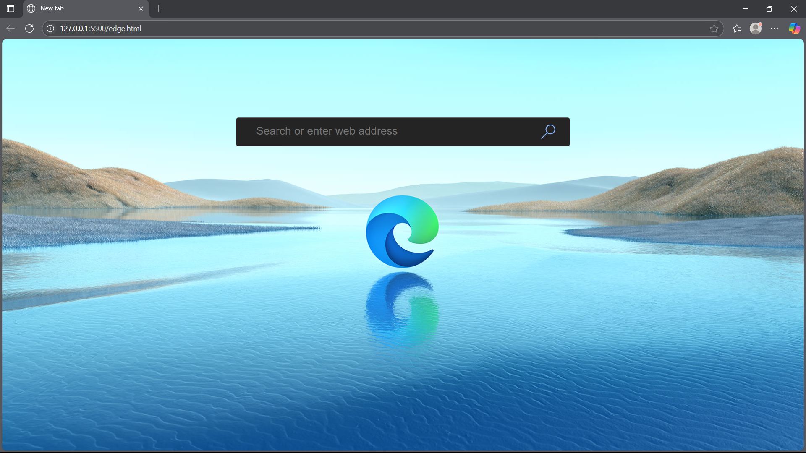
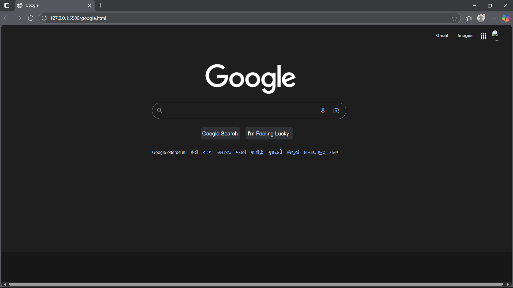

# 🌐 UI

This is a **UI clone** project built for educational and portfolio purposes. The goal was to **recreate the interface** of using modern frontend technologies like **HTML**, **CSS**, **JavaScript**, and optionally **React** or **Node.js**.

> 🔁 **Note:** This is not intended for commercial use. It's purely a personal skill showcase project.

---

## 📸 Demo Preview





---

## 🚀 Technologies Used

- ✅ HTML5
- 🎨 CSS3 (Flexbox / Grid / Tailwind / SCSS)
- ⚙️ JavaScript (Vanilla or ES6+)
- ⚛️ React.js (Optional)
- 🌐 Node.js / Express (Optional backend)

---

## 📁 Folder Structure
```bash

📂 uI
├── 📁 img
│   └── preview.png
├── 📁 demo
│   └── preview.png
├── index.html
├── style.css
└── README.md

```

## 🧠 What I Learned

- Practiced converting designs to code

- Improved responsive layout handling

- Strengthened CSS/JS fundamentals

- Used real-world UI patterns


## 🛠️ How to Run Locally

```bash

git clone https://github.com/Divya-Darshan/ui.git

```